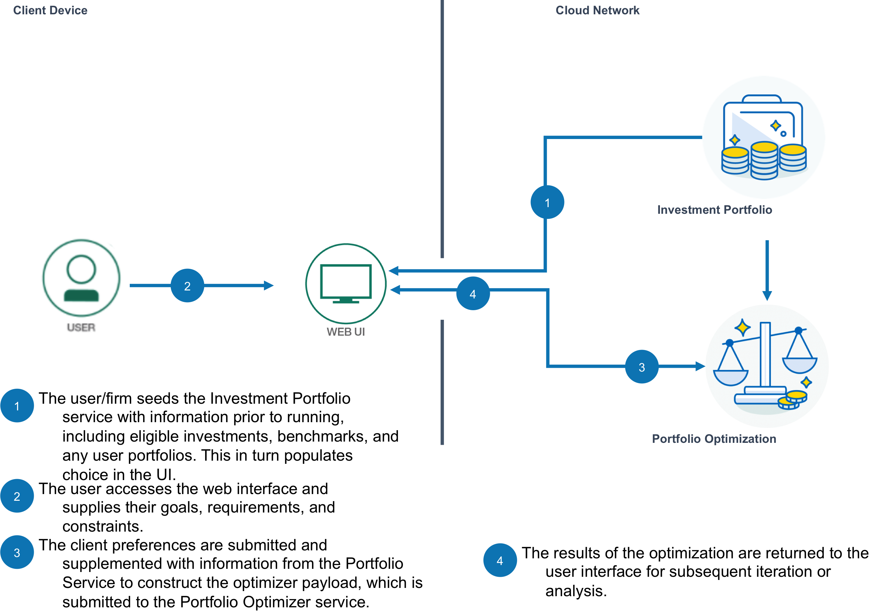

# Socially Responsible Investment Portfolio Construction

In this developer journey, we will demonstrate how to collect information from a user to build a socially responsible portfolio that maintains the same risk and return profile of a standardized portfolio. 

This journey leverages two services:
- The **Investment Portfolio service** is used to manage and store portfolios and financial security information such as the set of eligible investments, benchmarks, and user portfolios.
- The **Portfolio Optimization service** is used to determine an optimal set of holdings based on a user's constraints and preferences. This could be a [Markowitz](https://www.math.ust.hk/~maykwok/courses/ma362/07F/markowitz_JF.pdf) minimum variance, maximum return efficient portfolio or minimization of tracking error with respect to a benchmark. This journey explores the latter use case.

When the reader has completed this journey, they will understand how to:

* Load and retrieve data from the Investment Portfolio service
* Construct a payload to generate an optimization request from the Portfolio Optimization service.
* Construct a user interface to gather requirements and constraints from the user and return the details of the optimized portfolio.

<p align="center">
  
</p>


## Included Components
+ Bluemix Investment Portfolio
+ Bluemix Portfolio Optimization

# Deploy to Bluemix

[](https://bluemix.net/devops/setup/deploy?repository=https://github.com/IBM/Portfolio-Optimize)

**Note:** You need to prepopulate the Investment Portfolio service before running the front end. The process we outline below takes you through populating your portfolio using an endpoint (instead of a raw curl command). Therefore - Make sure you initalize the application by accessing the initialize endpoint in your browser by navigating to <http://0.0.0.0:8080/api/init>.  You need to execute the `python run.py` to make the init endpoint work. If you load the UI before running /api/init you'll get errors. See Step 6: [Initialize Investment Portfolio](#6-initalize-the-investment-portfolio-service) for more details.

# Running the Application Locally
Follow these steps to setup and run this developer journey. The steps are described in detail below.

## Prerequisites
- [Python](https://www.python.org/downloads/)

## Steps
1. [Clone the repo](#1-clone-the-repo)
2. [Create Bluemix services](#2-create-bluemix-services)
3. [Configure Manifest file](#3-configure-manifest)
4. [Configure .env file](#4-configure-env-file)
5. [Run Application](#5-run-application)
6. [Initialize Investment Portfolio](#6-initalize-the-investment-portfolio-service)

## 1. Clone the repo

Clone the `Build-an-optimal-investment-portfolio code` locally. In a terminal, run:

  `$ git clone https://github.com/IBM/Build-an-optimal-investment-portfolio.git`

## 2. Create Bluemix services

Create the following services:

* [**Investment Portfolio**](https://console.ng.bluemix.net/catalog/services/investment-portfolio)
* [**Portfolio Optimization**](https://console.bluemix.net/catalog/services/portfolio-optimization)

## 3. Configure Manifest file

Edit the `manifest.yml` file in the folder that contains your code and replace with a unique name for your application. The name that you specify determines the application's URL, such as `your-application-name.mybluemix.net`. Additionally - update the service names so they match what you have in Bluemix. The relevant portion of the `manifest.yml` file looks like the following:

  ```none
  declared-services:
    Investment-Portfolio:
      label: fss-portfolio-service
      plan: fss-portfolio-service-free-plan
    Portfolio-Optimization:
      label: fss-financial-optimization-service
      plan: fss-financial-optimization-service-free-plan
  applications:
  - path: .
    memory: 128M
    instances: 1
    name: Socially-Responsible-Investment-Portfolio-Construction
    disk_quota: 1024M
    domain: mybluemix.net
    services:
    - Investment-Portfolio
    - Portfolio-Optimization
    buildpack: python_buildpack
  ```

## 4. Configure .env file

Create a `.env` file in the root directory of your clone of the project repository by copying the sample `.env.example` file using the following command:

  ```none
  cp .env.example .env
  ```

  **NOTE** Most files systems regard files with a "." at the front as hidden files.  If you are on a Windows system, you should be able to use either [GitBash](https://git-for-windows.github.io/) or [Xcopy](https://www.microsoft.com/resources/documentation/windows/xp/all/proddocs/en-us/xcopy.mspx?mfr=true)

You will need to update the credentials with the Bluemix credentials for each of the services you created in [Step 2](#2-create-bluemix-services).

The `.env` file will look something like the following:

  ```none
# Investment Portfolio
CRED_PORTFOLIO_USERID_W=
CRED_PORTFOLIO_PWD_W=
CRED_PORTFOLIO_USERID_R=
CRED_PORTFOLIO_PWD_R=

# Portfolio Optimizer
CRED_OPTIMIZER_uri=https://fss-analytics.mybluemix.net/
CRED_OPTIMIZER_accessToken=
  ```

## 5. Run Application

cd into this project's root directory
+ Run `pip install -r requirements.txt` to install the app's dependencies
+ Run `python run.py`
+ Access the running app in a browser at <http://0.0.0.0:8080/>

## 6. Initalize the Investment Portfolio Service

The application relies on a few elements pre-populated in the Investment Portfolio service. The user interface will read from this service in order to retrieve the properties and selections that a user can interact with. 

Once the application is running, we can initialize the service by populating the Investment Portfolio service with the information it needs. 

Some points to note:
- make sure the `.env` file has been updated with your user credentials for the Investment Portfolio service.
- You can observe the financial security choices and meta-data in the `Instrument Universe.csv` file. 
- Benchmark options and weights are defined in the `benchmarks.csv` file. You can specify weights instead of position units (e.g. .25 for 25% allocation)
- An example user portfolio is defined in the `portfolio.csv` file. Here, position units are expected as the total value of the optimized portfolio will match the current value of this (unless a cash infusion is specified in the request).

To initalize the application, access the initialize endpoint in your browser by navigating to <http://0.0.0.0:8080/api/init>.

Find more information on Investment Portfolio api calls [here](https://console.ng.bluemix.net/apidocs/751-investment-portfolio?&language=node#introduction).

*Note that accessing the `/api/reset` endpoint will delete all of the portfolios in the service that the `/api/init` endpoint created. You can always start over this way, but be careful to not access this if you've done considerable work.*

# Troubleshooting

* To troubleshoot your Bluemix application, use the logs. To see the logs, run:

```bash
cf logs <application-name> --recent
```

* If you are running locally - inspect your environment variables closely to confirm they match.  Try running each service as standalone:

```bash
python InvestmentPortfolio.py
python PortfolioOptimization.py
```

# License

[Apache 2.0](LICENSE)
